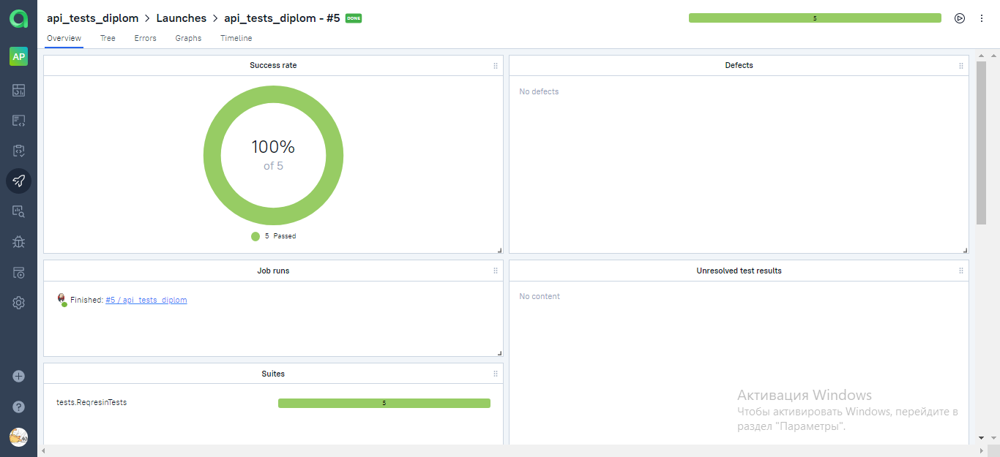
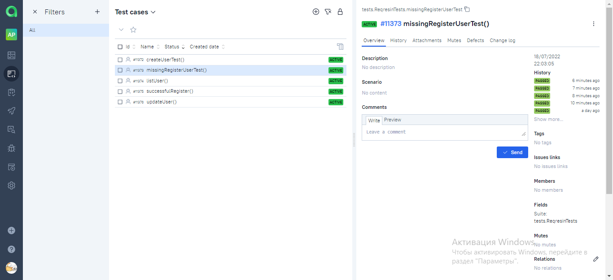
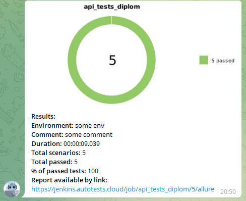

# Проект по автоматизации тестирования API на сайте - reqres.in.
> <a target="_blank" href="https://reqres.in/">Ссылка на страницу сайта</a>

###  Содержание:

- [Технологии и инструменты](#techno-технологии-и-инструменты)
- [Сборка в Jenkins](#jenkins-Jenkins-job)
- [Allure отчет](#report-Allure-отчет)
- [Интеграция с Allure TestOps](#Allure-TestOPS)
- [Отчет в Telegram](#telegram-Уведомление-в-Telegram-при-помощи-бота)

<a name="techno-технологии-и-инструменты"></a>
## Технологии и инструменты:

<p align="center">


</p>

## :arrow_forward: Запуск из терминала
Локальный запуск:
```
gradle clean test
```

<a name="jenkins-Jenkins-job"></a>
###   Сборка в Jenkins
###  Запуск тестов в [Jenkins](https://jenkins.autotests.cloud/job/api_tests_diplom/)
*Для запуска сборки необходимо нажать кнопку <code><strong>*Собрать сейчас*</strong></code>*

<p align="center">
  
</p>

<a name="report-Allure-отчет"></a>
##  Отчёт [Allure Reports](https://jenkins.autotests.cloud/job/api_tests_diplom/5/allure/)
<p align="center">
  
</p>

<p align="center">
  
</p>

<a name="Allure-TestOPS"></a>
###  Интеграция с [Allure TestOps](https://allure.autotests.cloud/launch/14588)
<p align="center">
  
</p>

<p align="center">
  
</p>

<a name="telegram-Уведомление-в-Telegram-при-помощи-бота"></a>
###  Отчет в Telegram

<p align="center">
  
</p>